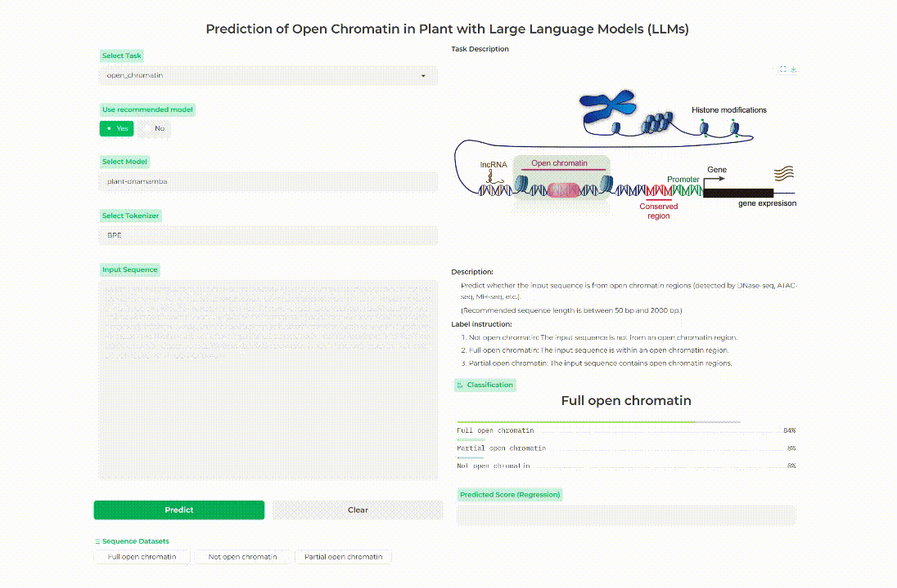

<h1>
  <p align="center">
  植物基础DNA大语言模型
  </p>
  <p align="center">
    (Plant foundation DNA large language models)
  </p>
</h1>

<p align="center">
  <b>简体中文 | </b>
  <a href="README.md" target="_blank"><b>English</b></a>
</p>

## 0. 模型预测DEMO



其他模型和对应任务的在线预测可以在[这里](https://finetune.plantllm.org/)查看.

## 1. 环境配置

推荐使用[Anaconda](https://docs.anaconda.com/free/anaconda/install/)包管理工具构建模型训练环境。对于预训练和微调模型，请确保你的电脑包含NVIDIA显卡，并且对应的显卡驱动正确安装。对于模型的推理，不包含显卡的设备，如纯CPU、苹果芯片等也可以使用。

#### 1.1 下载并安装 [Anaconda](https://www.anaconda.com/download)

#### 1.2 创建运行环境 (本环境已在python 3.11中测试)

```bash
conda create -n llms python=3.11
conda activate llms
```

#### 1.3 安装依赖

模型训练和推理需要确保[NVIDIA显卡的驱动](https://www.nvidia.com/download/index.aspx)被正确安装，此外对应的[CUDA驱动](https://developer.nvidia.com/cuda-downloads)（版本>11.0, 本环境使用CUDA 12.1）也要安装。


另外，对应版本的[Pytorch](https://pytorch.org/)包（版本>=2.0）也要安装好。推荐使用 `pip` 安装python依赖包。请一定认真安装对应的cuda和torch版本，本测试环境中使用的cuda版本为12.1。pytorch详细安装教程请参考[官方网站](https://pytorch.org/)。

```bash
pip install 'torch<2.5' 
```

如果只需要进行模型推理（预测任务），也可以只安装CPU版本的Pytorch。

```bash
pip install 'torch<2.5' 
```

下一步，克隆本仓库，并安装其他模型训练/推理所需的依赖。

```bash
git clone --recursive https://github.com/zhangtaolab/Plant_DNA_LLMs
cd Plant_DNA_LLMs
pip install -r requirements.txt
```

（可选步骤）如果需要训练[Mamba](https://github.com/state-spaces/mamba)模型，还需要安装以下这些额外的依赖；此外，DNA Mamba模型的训练和推理必须使用NVIDIA显卡。  
注意Mamba模型最低支持Nvidia 10系以上的显卡（如GTX1660s，RTX2080, RTX3060, RTX4070等，不支持GTX1080Ti等20系列以下的显卡）

```bash
pip install 'causal-conv1d<=1.3'
pip install 'mamba-ssm<2'
```

#### 1.4 安装git-lfs
`glt-lfs`主要用于下载大语言模型和数据集，`git-lfs`安装教程参考 [git-lfs install](https://github.com/git-lfs/git-lfs?utm_source=gitlfs_site&utm_medium=installation_link&utm_campaign=gitlfs#installing)。如果安装成功
```bash
$ git lfs version
```
会显示类似的结果
```bash
git-lfs/3.3.0 (GitHub; linux amd64; go 1.19.8)
```

## 2. 模型微调

微调植物DNA大语言模型前，需要先从[ModelScope](https://www.modelscope.cn/organization/zhangtaolab)或[HuggingFace](https://huggingface.co/zhangtaolab)网站下载需要的模型。可以使用 `git clone` 命令行（确保 `git-lfs` 命令正确安装）下载模型，或者直接在网页点击下载将模型下载到本地。

在激活的 `llms` conda环境下，可以使用 `model_finetune.py` 脚本针对下游任务微调模型。

脚本接受 `.csv` 格式的输入文件（以逗号 `,` 分隔），当准备训练数据时，确保数据文件包含表头，且至少包含序列和标签这两列：
```csv
sequence,label
```

`sequence`对应的是输入序列， `label`代表输入序列对应的类别或得分。

用户可以使用自己的数据做模型微调，此外我们也提供了一系列的植物基因组数据集用于微调模型的训练。用户可以在[ModelScope](https://www.modelscope.cn/organization/zhangtaolab)和[HuggingFace](https://huggingface.co/zhangtaolab)网站自行下载使用。

* 预训练模型的列表可参考 [预训练模型列表](docs/zh/pretrain_models_zh.md)

这里我们以基于BPE tokenizer的Plant DNAGPT模型为例，预测植物活性启动子。

首先先从ModelScope或Huggingface下载微调模型和对应的数据集：

```bash
# 准备一个工作目录
mkdir LLM_finetune
cd LLM_finetune
# 下载预训练模型
git clone https://modelscope.cn/models/zhangtaolab/plant-dnagpt-BPE
# 下载训练数据集
git clone https://modelscope.cn/datasets/zhangtaolab/plant-multi-species-core-promoters
```

模型文件和训练数据准备好后，可以使用如下命令微调模型（这里以预测启动子任务为例）：

```bash
python model_finetune.py \
    --model_name_or_path plant-dnagpt-BPE \
    --train_data plant-multi-species-core-promoters/train.csv \
    --test_data plant-multi-species-core-promoters/test.csv \
    --eval_data plant-multi-species-core-promoters/dev.csv \
    --train_task classification \
    --labels 'Not promoter;Core promoter' \
    --run_name plant_dnagpt_BPE_promoter \
    --per_device_train_batch_size 4 \
    --per_device_eval_batch_size 8 \
    --learning_rate 1e-5 \
    --num_train_epochs 5 \
    --load_best_model_at_end \
    --metric_for_best_model 'f1' \
    --save_strategy epoch \
    --logging_strategy epoch \
    --evaluation_strategy epoch \
    --output_dir plant-dnagpt-BPE-promoter
```

以上的命令中，不同参数的介绍如下：  
1. `--model_name_or_path`: 基础DNA模型的路径
2. `--train_data`: 待训练数据中训练集的路径
3. `--test_data`: 待训练数据中测试集的路径（如果没有可以忽略）
4. `--dev_data`: 待训练数据中验证集的路径（如果没有可以忽略）
5. `--train_task`: 任务类型，可以是`classification`（二分类）、`multi-classification`（多分类）和`regression`（回归）
6. `--labels`: 分类任务的标签，以 `;` 分隔
7. `--run_name`: 微调模型的名称
8. `--per_device_train_batch_size`: 模型训练时的batch size
9. `--per_device_eval_batch_size`: 模型评估时的batch size
10. `--learning_rate`: 学习率
11. `--num_train_epochs`: 模型训练时的epoch数 (如果希望以`steps`进行训练，使用`--num_train_steps`参数, 需要确保模型保存、日志和评估的方法也都改成`steps`)
12. `--load_best_model_at_end`: 是否在训练完成后保存最好的模型，默认是 `True`
13. `--metric_for_best_model`: 使用哪个指标评估最好的模型, 默认是 `loss`, 还可以是 `accuracy`, `precison`, `recall`, `f1` 或 `matthews_correlation`（分类任务）,  `r2` 或 `spearmanr`（回归任务）
14. `--save_strategy`: 模型保存的方法，可以是 `epoch` or `steps`
15. `--logging_strategy`: 模型训练日志输出的方法，可以是 `epoch` or `steps`
16. `--evaluation_strategy`: 模型评估的方法，可以是  `epoch` or `steps`
17. `--output_dir`: 微调模型的保存路径

更多关于参数的细节，可以参考[transformers官方文档](https://huggingface.co/docs/transformers/en/main_classes/trainer#transformers.TrainingArguments)。

最后，等待进度条结束，微调好的模型会保存在`plant-dnagpt-BPE-promoter`目录中。在该目录中，会包含checkpoint目录，runs目录，以及保存好的微调模型。

## 3. 模型推理

在使用微调模型推理（预测任务）前，请先下载已经我们提供的微调模型（[ModelScope](https://www.modelscope.cn/organization/zhangtaolab) 或 [HuggingFace](https://huggingface.co/zhangtaolab)）到本地，或使用前面提供的脚本自己训练一个微调模型用于推理。

* 微调模型的列表可参考 [微调模型列表](docs/zh/finetune_models_zh.md)

这里我们以基于BPE tokenizer的Plant DNAGPT模型为例，预测植物活性启动子。

首先先从ModelScope或Huggingface下载微调模型和对应的数据集：

```bash
# 准备一个工作目录
mkdir LLM_inference
cd LLM_inference
# 下载预训练模型
git clone https://modelscope.cn/models/zhangtaolab/plant-dnagpt-BPE-promoter
# 下载训练数据集
git clone https://modelscope.cn/datasets/zhangtaolab/plant-multi-species-core-promoters
```

我们同样提供了模型推理的脚本 `model_inference.py` ，下面是预测植物活性启动子的例子：

```bash
# （方法1）使用本地模型推理（直接输入序列）
python model_inference.py -m plant-dnagpt-BPE-promoter -s 'TTACTAAATTTATAACGATTTTTTATCTAACTTTAGCTCATCAATCTTTACCGTGTCAAAATTTAGTGCCAAGAAGCAGACATGGCCCGATGATCTTTTACCCTGTTTTCATAGCTCGCGAGCCGCGACCTGTGTCCAACCTCAACGGTCACTGCAGTCCCAGCACCTCAGCAGCCTGCGCCTGCCATACCCCCTCCCCCACCCACCCACACACACCATCCGGGCCCACGGTGGGACCCAGATGTCATGCGCTGTACGGGCGAGCAACTAGCCCCCACCTCTTCCCAAGAGGCAAAACCT'

# （方法2）使用本地模型推理（提供一个包含多条待预测序列的文件用于推理）
python model_inference.py -m plant-dnagpt-BPE-promoter -f plant-multi-species-core-promoters/test.csv -o promoter_predict_results.txt

# （方法3）使用在线下载的模型进行推理（直接从modelscope或huggingface读取我们训练的模型，不从本地读取）
python model_inference.py -m zhangtaolab/plant-dnagpt-BPE-promoter -ms modelscope -s 'GGGAAAAAGTGAACTCCATTGTTTTTTCACGCTAAGCAGACCACAATTGCTGCTTGGTACGAAAAGAAAACCGAACCCTTTCACCCACGCACAACTCCATCTCCATTAGCATGGACAGAACACCGTAGATTGAACGCGGGAGGCAACAGGCTAAATCGTCCGTTCAGCCAAAACGGAATCATGGGCTGTTTTTCCAGAAGGCTCCGTGTCGTGTGGTTGTGGTCCAAAAACGAAAAAGAAAGAAAAAAGAAAACCCTTCCCAAGACGTGAAGAAAAGCAATGCGATGCTGATGCACGTTA'
```

以上的命令中，不同参数的介绍如下：  
1. `-m`: 微调模型的路径
2. `-s`: 待预测的序列, 只支持包含A, C, G, T, N碱基的序列
3. `-f`: 包含多条待预测序列的文件，一行对应一条序列。如果需要保留更多的信息，使用 `,` 或者 `\t` 分隔符，但是包含表头的 `sequence` 列必须指定
4. `-ms`: 如果模型没有下载到本地，可以从`modelscope`或`huggingface`读取，模型名称格式为`zhangtaolab/model-name`, 用户可以从这里复制模型名，防止拼写错误


输出结果会包含原始序列，序列的长度，如果是分类任务，会返回预测的分类结果及其对应的预测可能性；如果是回归任务，会返回预测的得分。


## 4. 使用docker在本地推理模型

前面提到的大语言模型训练所需环境的构建比较繁琐，需要安装大量的依赖。为了精简这一过程，我们提供了一个基于docker的镜像，方便用户快速实现模型推理。
 
docker镜像可以在[这里查看](https://hub.docker.com/r/zhangtaolab/plant_llms_inference)，此外，使用docker进行模型推理的例子已在下方展示。

#### 基于显卡（GPU）进行推理

我们提供了2种模型推理的镜像，对于有NVIDIA显卡的设备，可以拉取 `gpu` 标签的docker镜像，同时确保电脑里已经正确安装了 [Nvidia Container Toolkit](https://docs.nvidia.com/datacenter/cloud-native/container-toolkit/latest/install-guide.html)。

首先先从ModelScope或Huggingface下载微调模型，这里以Plant DNAMamba模型为例，预测活性启动子。

```bash
# 准备一个工作目录
mkdir LLM_inference
cd LLM_inference
git clone https://modelscope.cn/models/zhangtaolab/plant-dnamamba-BPE-promoter
```

接着下载对应的数据集，如果用户有自己的数据，也可以根据前面提到的推理数据格式准备自定义数据集。

```bash
git clone https://modelscope.cn/datasets/zhangtaolab/plant-multi-species-core-promoters
```

模型和数据集准备完毕后，从docker拉取我们的模型推理镜像，并测试是否可以正常运行。

```bash
# 如果下载失败，可能是网络问题，请重新运行命令多试几次
docker pull cr.bioinfor.eu.org/zhangtaolab/plant_llms_inference:gpu
# 下载完成后，运行以下命令检查镜像能否运行成功
docker run --runtime=nvidia --gpus=all -v ./:/home/llms cr.bioinfor.eu.org/zhangtaolab/plant_llms_inference:gpu -h
```

```bash
usage: inference.py [-h] [-v] -m MODEL [-f FILE] [-s SEQUENCE] [-t THRESHOLD]
                    [-l MAX_LENGTH] [-bs BATCH_SIZE] [-p SAMPLE] [-seed SEED]
                    [-d {cpu,gpu,mps,auto}] [-o OUTFILE] [-n]

Script for Plant DNA Large Language Models (LLMs) inference

options:
  -h, --help            show this help message and exit
  -v, --version         show program's version number and exit
  -m MODEL              Model path (should contain both model and tokenizer)
  -f FILE               File contains sequences that need to be classified
  -s SEQUENCE           One sequence that need to be classified
  -t THRESHOLD          Threshold for defining as True class (Default: 0.5)
  -l MAX_LENGTH         Max length of tokenized sequence (Default: 512)
  -bs BATCH_SIZE        Batch size for classification (Default: 1)
  -p SAMPLE             Subsampling for testing (Default: 1e7)
  -seed SEED            Random seed for subsampling (Default: None)
  -d {cpu,gpu,mps,auto}
                        Choose CPU or GPU to do inference (require specific
                        drivers) (Default: auto)
  -o OUTFILE            Prediction results (Default: stdout)
  -n                    Whether or not save the runtime locally (Default:
                        False)

Example:
  docker run --runtime=nvidia --gpus=all -v /local:/container zhangtaolab/plant_llms_inference:gpu -m model_path -f seqfile.csv -o output.txt
  docker run --runtime=nvidia --gpus=all -v /local:/container zhangtaolab/plant_llms_inference:gpu -m model_path -s 'ATCGGATCTCGACAGT' -o output.txt
```

成功出现以上信息，说明镜像下载完整，且可以正常运行推理脚本。  
下面使用先前准备好的模型和数据集进行推理。

```bash
docker run --runtime=nvidia --gpus=all -v ./:/home/llms cr.bioinfor.eu.org/zhangtaolab/plant_llms_inference:gpu -m /home/llms/plant-dnamamba-BPE-promoter -f /home/llms/plant-multi-species-core-promoters/test.csv -o /home/llms/predict_results.txt
```

稍等推理进度条完成后，在本地当前目录浏览`predict_results.txt`，该文件保存了输入文件中每条序列对应的预测结果。

#### 基于CPU进行推理

对于没有显卡的机器，可以拉取 `cpu` 标签的docker镜像，该镜像基本适用于所有设备，包括纯CPU、苹果芯片设备等，不过需要注意的是，该镜像暂时无法推理DNA Mamba模型。

首先先下载从ModelScope或Huggingface下载微调模型，这里以Plant DNAGPT模型为例，预测活性启动子。

```bash
# 准备一个工作目录
mkdir LLM_inference
cd LLM_inference
git clone https://modelscope.cn/models/zhangtaolab/plant-dnagpt-BPE-promoter
```

接着下载对应的数据集，如果用户有自己的数据，也可以根据前面提到的推理数据格式准备自定义数据集。

```bash
git clone https://modelscope.cn/datasets/zhangtaolab/plant-multi-species-core-promoters
```

模型和数据集准备完毕后，从docker拉取我们的模型推理镜像，并测试是否可以正常运行。

```bash
docker pull cr.bioinfor.eu.org/zhangtaolab/plant_llms_inference:cpu
docker run -v ./:/home/llms cr.bioinfor.eu.org/zhangtaolab/plant_llms_inference:cpu -h
```

```bash
usage: inference.py [-h] [-v] -m MODEL [-f FILE] [-s SEQUENCE] [-t THRESHOLD]
                    [-l MAX_LENGTH] [-bs BATCH_SIZE] [-p SAMPLE] [-seed SEED]
                    [-d {cpu,gpu,mps,auto}] [-o OUTFILE] [-n]

Script for Plant DNA Large Language Models (LLMs) inference

options:
  -h, --help            show this help message and exit
  -v, --version         show program's version number and exit
  -m MODEL              Model path (should contain both model and tokenizer)
  -f FILE               File contains sequences that need to be classified
  -s SEQUENCE           One sequence that need to be classified
  -t THRESHOLD          Threshold for defining as True class (Default: 0.5)
  -l MAX_LENGTH         Max length of tokenized sequence (Default: 512)
  -bs BATCH_SIZE        Batch size for classification (Default: 1)
  -p SAMPLE             Subsampling for testing (Default: 1e7)
  -seed SEED            Random seed for subsampling (Default: None)
  -d {cpu,gpu,mps,auto}
                        Choose CPU or GPU to do inference (require specific
                        drivers) (Default: auto)
  -o OUTFILE            Prediction results (Default: stdout)
  -n                    Whether or not save the runtime locally (Default:
                        False)

Example:
  docker run -v /local:/container zhangtaolab/plant_llms_inference:gpu -m model_path -f seqfile.csv -o output.txt
  docker run -v /local:/container zhangtaolab/plant_llms_inference:gpu -m model_path -s 'ATCGGATCTCGACAGT' -o output.txt
```

成功出现以上信息，说明镜像下载完整，且可以正常运行推理脚本。  
下面使用先前准备好的模型和数据集进行推理。

```bash
docker run -v ./:/home/llms cr.bioinfor.eu.org/zhangtaolab/plant_llms_inference:cpu -m /home/llms/plant-dnagpt-BPE-promoter -f /home/llms/plant-multi-species-core-promoters/test.csv -o /home/llms/predict_results.txt
```

稍等推理进度条完成后，在本地当前目录浏览`predict_results.txt`，该文件保存了输入文件中每条序列对应的预测结果。

* 脚本中其他参数的说明可以参考 [模型推理](#3-模型推理) 中的使用说明。


### 在线预测平台

为了方便用户使用模型预测DNA分析任务，我们也提供了在线的预测平台。

请参考：[在线预测列表](docs/platforms_zh.md)
