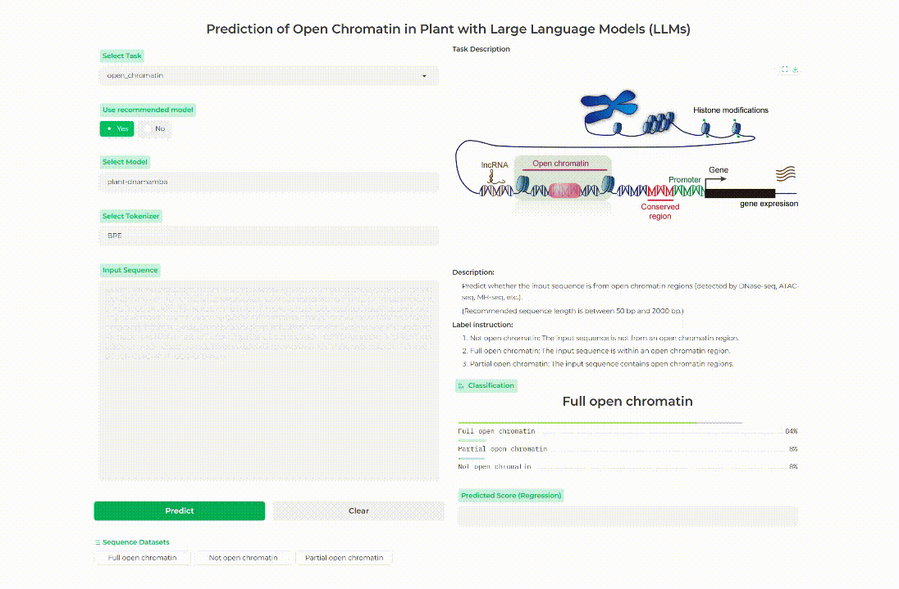

<h1>
  

  PDLLMs: A group of tailored DNA large language models for analyzing plant genomes
  

</h1>

## Demo for plant DNA LLMs prediction

Online prediction of other models and prediction tasks can be found [here](https://finetune.plantllm.org/).
